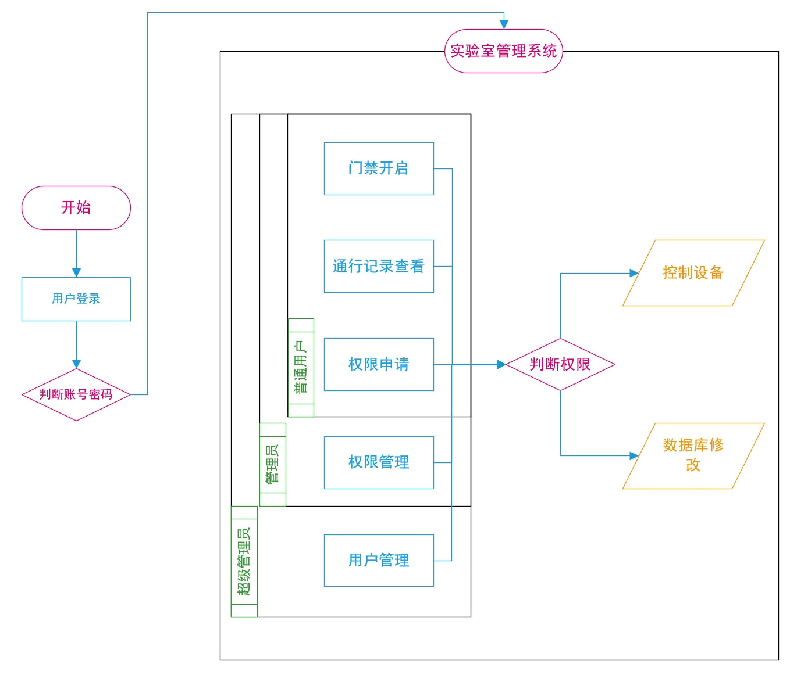
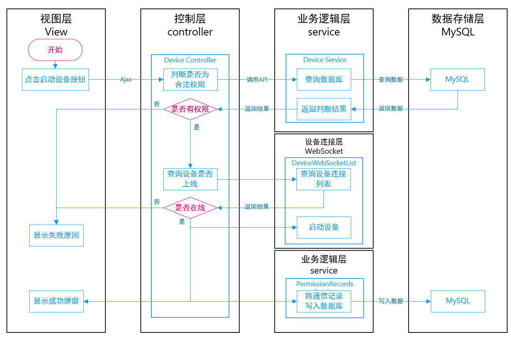

## 项目综述

这是本人门禁系统的后端子项目，参考了[瑞吉外卖](https://www.bilibili.com/video/BV13a411q753)，如果你是从零开始，请看 [学习路径](https://github.com/Sand-van/Gate_system_backEnd/blob/master/学习路径.md)

## 运行环境

|指标项|配置参数|
|--|--|
|操作系统|Windows 11 专业版 22H2, build 22621.1413|
|后端IDE|IntelliJ IDEA 2022.3.2 (Ultimate Edition)|
|数据库|MySQL 5.7.24|
|JDK|Java 1.8.0_362|
|SpringBoot|spring boot framwork 2.4.5|

## 使用方式

使用IEDA导入后，直接运行`GateSystemApplication`即可

## 数据库设计

使用PDmaner进行数据库建模，将设计文件`门禁系统.pdma.json`导入PDmaner即可。

也可使用`gate_system.sql`导入数据库，里面包含了一些测试数据，如测试超级管理员账户为123456；密码为123456。

## 项目文件结构

- src：源码文件夹
  - test：测试文件夹，不重要
  - main：主文件夹
    - resource：静态资源文件，由于前后端分离所以没用
    - java.com.chao：源码文件夹，按照[瑞吉外卖](https://www.bilibili.com/video/BV13a411q753)项目规范分类
      - common：通用文件夹，里面存放了各种工具类
      - config：配置文件夹，进行各种插件的配置
      - controller：业务实现文件夹，里面具体进行各种业务的实现
      - dto：数据传输对象文件夹，里面存放与前端服务器数据交换的类
      - entity：实体类文件夹，与数据库中各个表一一对应
      - filter：过滤器，过滤各种请求
      - interceptor：拦截器，判断token有效性
      - mapper：数据库连接类
      - service：数据库读写类

## 项目流程图

启动设备流程图
